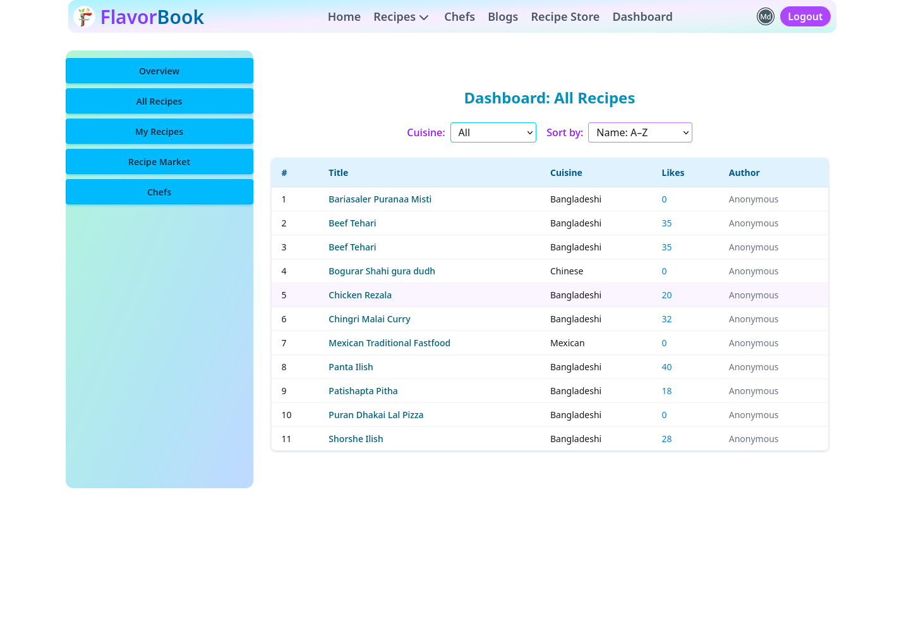

# 🍽️ FlavorBook - Recipe & Chef Marketplace Web App

Welcome to **FlavorBook**, a full-featured and beautifully crafted web application designed to connect food lovers with chefs, ingredients, and delicious recipes. This platform allows users to browse, create, and manage recipes, explore blogs, book chefs, and even shop for ingredients—all in one place.

---

## 📌 Project Overview

| Detail                 | Information                                                                        |
| ---------------------- | ---------------------------------------------------------------------------------- |
| **GitHub Client site** | [ass-client](https://github.com/mdshahjalal5/ass-client)                           |
| **Live Site client**   | [flavorbook.surge.sh](https://flavorbook.surge.sh/)                                |
| **GitHub server site** | [10miass](https://github.com/shahjalal-labs/10miass)                               |
| **Live Site server**   | [worlds-recipes-sharing-server](https://worlds-recipes-sharing-server.vercel.app/) |
| **Portfolio GitHub**   | [shahjalal-portfolio](https://github.com/mdshahjalal5/shahjalal-portfolio)         |
| **Portfolio Live**     | [shahjalal-labs.surge.sh](http://shahjalal-labs.surge.sh/)                         |
| **Created On**         | 20 May 2025, 10:32 AM GMT+6                                                        |
| **Location**           | Sharifpur, Gazipur, Dhaka, Bangladesh                                              |
| **LinkedIn**           | [md-sj](https://www.linkedin.com/in/md-sj-825bb4341/)                              |
| **Facebook**           | [Profile](https://www.facebook.com/profile.php?id=61556383702555)                  |
| **YouTube**            | [Channel](https://www.youtube.com/@muhommodshahjalal9811)                          |

## 🌐 Live Site

[🔗 Deployed App](#) _(https://flavorbook.surge.sh/)_

---

## 📁 Project Structure

Here's a high-level overview of the project's file structure:

```
.
├── public/               # Static assets (favicon, CNAME, vite.svg)
├── dist/                 # Production build
├── src/                  # Main application source code
│   ├── animation/        # Lottie files and animation components
│   ├── assets/           # Images, logos, and JSON
│   ├── components/       # Reusable UI components (Header, Banner, Footer)
│   ├── hooks/            # Custom React hooks
│   ├── Layout/           # Route layouts
│   ├── modules/          # Domain-based modules
│   │   ├── auth/         # Authentication
│   │   ├── blogs/        # Blog system
│   │   ├── chef/         # Chef booking system
│   │   ├── recipe/       # Recipes
│   │   └── RecipieMarket # Recipe ingredient marketplace
│   ├── pages/            # Page components
│   ├── provider/         # Context Providers (Auth)
│   ├── Routes/           # Routing logic
│   ├── index.css         # Tailwind styles
│   ├── App.jsx           # Main App component
│   └── main.jsx          # App bootstrap
├── README.md             # You're here
├── vite.config.js        # Vite configuration
├── eslint.config.js      # Linting rules
└── package.json          # Project metadata
```

---

## 🧭 Routing Structure (with Layouts)

### 🔐 Auth Layout

- `/login` → `Login.jsx`
- `/register` → `Register.jsx`
- `/forgot-password` → `ForgotPassword.jsx`

### 🏠 Main Layout (Landing Pages)

- `/` → `Home.jsx`
- `/about` → `About.jsx`
- `/contact` → `Contact.jsx`
- `/faq` → `Faq.jsx`
- `/privacy-policy` → `PrivacyPolicy.jsx`
- `/terms-and-conditions` → `TermsCondintion.jsx`

### 🧑‍🍳 Chef Feature (via `ChefLayout.jsx`)

- `/chefs` → `Chefs.jsx`
- `/chefs/:id` → `ChefDetails.jsx`
- `/chefs/:id/book` → `ChefCheckout.jsx`
- `/create-chef` → `CreateChef.jsx`
- `/update-chef/:id` → `UpdateChef.jsx`

### 📚 Blog Feature (via `BlogsLayout.jsx`)

- `/blogs` → `Blogs.jsx`
- `/blogs/:id` → `BlogDetails.jsx`
- `/create-blog` → `CreateBlog.jsx`

### 🍲 Recipes

- `/add-recipe` → `AddRecipe.jsx`
- `/my-recipes` → `MyRecipes.jsx`
- `/recipe/:id` → `RecipeDetails.jsx`
- `/update-recipe/:id` → `UpdateRecipe.jsx`

### 🛒 Recipe Market (via `RecipeMarketLayout.jsx`)

- `/recipe-market` → `MarketHome.jsx`
- `/recipe-market/:id` → `IngredientDetails.jsx`
- `/create-ingredient` → `CreateRecipeIngredient.jsx`

### 👤 Profile

- `/my-profile` → `MyProfile.jsx`
- `/update-profile` → `UpdateProfile.jsx`

---

## 🔑 Features

### ✅ Authentication

- Firebase Auth integration
- Login, Register, Forgot Password
- Auth-protected routes

### 🍽️ Recipe System

- Add, update, and delete personal recipes
- View all recipes with tags, categories, and details

### 🧑‍🍳 Chef Booking

- View all chefs
- Chef details with biography, rating, and services
- Book chefs and proceed to checkout

### 🛍️ Ingredient Marketplace

- Browse ingredients listed by sellers
- View ingredient details
- Add to cart and complete orders
- Sellers can list their own ingredients

### 📝 Blog System

- View all blogs
- Blog details with comments, read time, tags
- Create and share new blogs

### 🎨 Design & Animation

- TailwindCSS + modern UI components
- Lottie animations (Lottie JSON files)
- Smooth transitions and effects
- Mobile responsive design

---

## 🛠️ Tech Stack

- **Frontend**: React.js, Tailwind CSS
- **Routing**: React Router 
- **Forms**: React Hook Form, React Day Picker
- **State Management**: React Context API (AuthProvider)
- **Animations**: Lottie
- **Toast Notifications**: React Hot Toast
- **Deployment**: GitHub Pages / Vercel / Netlify (configure as needed)
- **Build Tool**: Vite

---

## 📦 Installation

```bash
bun install  # or npm install
bun run dev  # or npm run dev
```

---

## 📌 TODOs

- ***

## 👏 Credits

- Design inspired by classic cooking & recipe books
- Icons via Lucide and Heroicons
- Lottie animations from LottieFiles

---

## 📄 License

This project is licensed under the MIT License.

---

Made with ❤️ for food enthusiasts and aspiring chefs.

> "Food is symbolic of love when words are inadequate." — Alan D. Wolfelt

----- preivous version ------

# 🍽️ FlavorBook – Recipe Sharing Platform

Welcome to **FlavorBook**, a dynamic recipe-sharing platform designed to connect culinary enthusiasts. Users can explore, share, and manage recipes with ease, all within a secure and responsive web application.

---

---

## 🚀 Features

### 🔐 Authentication & Security

- **Email/Password Login**: Secure user authentication via Firebase.
- **Google Sign-In**: Quick access using Google accounts.
- **Protected Routes**: Restricts access to sensitive pages like profile and recipe details.
- **Password Reset**: Users can reset passwords through email verification.

### 🧾 Recipe Management

- **All Recipes page**: Display recipes with JSON-based data.
- **Add/Update/Delete Recipes**: Users can create,modify and delete their own recipes.
- **Recipe Details**: View comprehensive information about each recipe.

### 👤 User Profile

- **Profile Page**: View and edit user information, including display name and photo.
- **Update Profile**: Modify personal details securely.

### 📄 Additional Pages

- **About**: Learn more about FlavorBook.
- **Contact**: Get in touch with the team.
- **FAQ**: Frequently Asked Questions.
- **Privacy Policy**: Understand how user data is handled.
- **Terms & Conditions**: Legal information regarding the use of FlavorBook.

### 🎨 UI/UX Enhancements

- **Responsive Design**: Optimized for various devices.
- **Tailwind CSS & DaisyUI**: Utilized for styling and component design.
- **Lottie Animations**: Engaging animations for better user experience.
- **Swiper**: Interactive sliders for showcasing content.

---

## 🛠️ Technology Stack

| Technology             | Purpose                                 |
| ---------------------- | --------------------------------------- |
| **React**              | Frontend library for building UI        |
| **React Router**       | Routing within the application          |
| **Tailwind CSS**       | Utility-first CSS framework             |
| **DaisyUI**            | Tailwind CSS component library          |
| **Firebase**           | Backend services (Authentication, etc.) |
| **React Helmet Async** | Manage document head for SEO            |
| **Swiper**             | Implementing sliders                    |
| **React Lottie**       | Adding animations                       |

---

## 📁 Project Structure

```md
.
├── bun.lock
├── dist
│   ├── 200.html
│   ├── assets
│   │   ├── banner3-CqKNlaJH.jpeg
│   │   ├── index-Dap1SDNE.css
│   │   └── index-DXWNyiPp.js
│   ├── CNAME
│   ├── index.html
│   └── vite.svg
├── eslint.config.js
├── index.html
├── package.json
├── PKGBUILD
├── public
│   ├── CNAME
│   └── vite.svg
├── README.md
├── requirement.md
├── src
│   ├── animation
│   │   ├── AwesomeReveal.jsx
│   │   ├── cooking.json
│   │   ├── index.js
│   │   ├── loginAnimation2.json
│   │   ├── loginAnimation3.json
│   │   ├── loginAnimation.json
│   │   ├── male_cooking.json
│   │   ├── mango_walking.json
│   │   ├── profileAnimation.json
│   │   └── Walking.jsx
│   ├── App.jsx
│   ├── assets
│   │   ├── flavorBooks
│   │   │   ├── Animation - 1747955888499.json
│   │   │   ├── banner1.jpg
│   │   │   ├── banner2.jpeg
│   │   │   ├── banner3.jpeg
│   │   │   ├── banner_indicator.jpg
│   │   │   ├── long_banner.jpg
│   │   │   ├── looka_logo_black.svg
│   │   │   └── output.jpg
│   │   ├── index.js
│   │   ├── logo.png
│   │   └── notfound3.jpg
│   ├── bun.lock
│   ├── components
│   │   ├── Banner.jsx
│   │   ├── Brand.jsx
│   │   ├── Button.jsx
│   │   ├── Errorpage.jsx
│   │   ├── FooterLinks.jsx
│   │   ├── Header.jsx
│   │   ├── Home.jsx
│   │   ├── Input.jsx
│   │   ├── Menu.jsx
│   │   ├── Nav.jsx
│   │   ├── Newsletter.jsx
│   │   ├── Recipe.jsx
│   │   ├── Recipes.jsx
│   │   └── Slider.jsx
│   ├── constant.jsx
│   ├── firebase
│   │   └── firebase.config.js
│   ├── hooks
│   │   ├── ThemeSwitcher.jsx
│   │   └── Usefetch.jsx
│   ├── index.css
│   ├── Layout
│   │   ├── AuthLayout.jsx
│   │   ├── BlogsLayout.jsx
│   │   ├── ChefLayout.jsx
│   │   └── Layout.jsx
│   ├── main.jsx
│   ├── modules
│   │   ├── auth
│   │   │   └── authRoutes.jsx
│   │   ├── blogs
│   │   │   ├── blog.constant.js
│   │   │   ├── BlogDetails.jsx
│   │   │   ├── Blog.jsx
│   │   │   ├── blogRoute.jsx
│   │   │   ├── BlogSidebar.jsx
│   │   │   ├── Blogs.jsx
│   │   │   └── CreateBlog.jsx
│   │   ├── chef
│   │   │   ├── ChefChekout.jsx
│   │   │   ├── chef.constant.js
│   │   │   ├── ChefDetails.jsx
│   │   │   ├── chefRoute.jsx
│   │   │   ├── Chefs.jsx
│   │   │   ├── CreateChef.jsx
│   │   │   └── UpdateChef.jsx
│   │   ├── recipe
│   │   │   └── recipeRoutes.jsx
│   │   └── RecipieMarket
│   │   ├── CreateRecipeIngredient.jsx
│   │   ├── IngredientCard.jsx
│   │   ├── ingredient.constant.js
│   │   ├── IngredientDetails.jsx
│   │   ├── MarketHome.jsx
│   │   ├── RecipeMarketHeader.jsx
│   │   ├── RecipeMarketLayout.jsx
│   │   └── RecipeMarkteRoutes.jsx
│   ├── package.json
│   ├── pages
│   │   ├── About.jsx
│   │   ├── AddRecipe.jsx
│   │   ├── Contact.jsx
│   │   ├── Faq.jsx
│   │   ├── FeedbackPage.jsx
│   │   ├── Footerr.jsx
│   │   ├── ForgotPassword.jsx
│   │   ├── Login.jsx
│   │   ├── MyProfile.jsx
│   │   ├── MyRecipes.jsx
│   │   ├── NoRecipe.jsx
│   │   ├── PrivacyPolicy.jsx
│   │   ├── RecipeDetails.jsx
│   │   ├── Register.jsx
│   │   ├── TermsCondintion.jsx
│   │   ├── UpdateProfile.jsx
│   │   └── UpdateRecipe.jsx
│   ├── provider
│   │   └── AuthProvider.jsx
│   ├── Routes
│   │   ├── PrivateRoute.jsx
│   │   └── Router.jsx
│   └── tailwind.config.js
├── structure.md
└── vite.config.js

21 directories, 111 files
```

### `Developer Info:`


### home page preview:

#### Desktop view:


#### Laptop view:


#### Mobile view:


---

### Dashboard preview:

#### Desktop view:


---

#### All Recipes:


